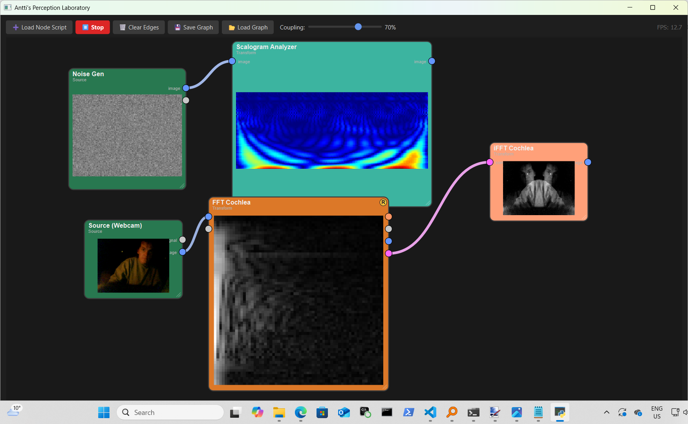
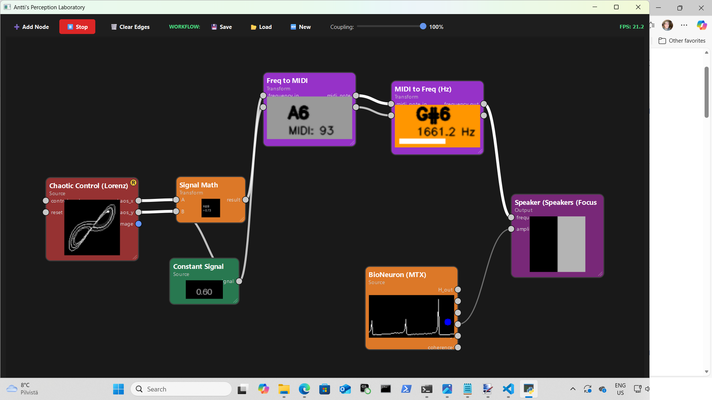
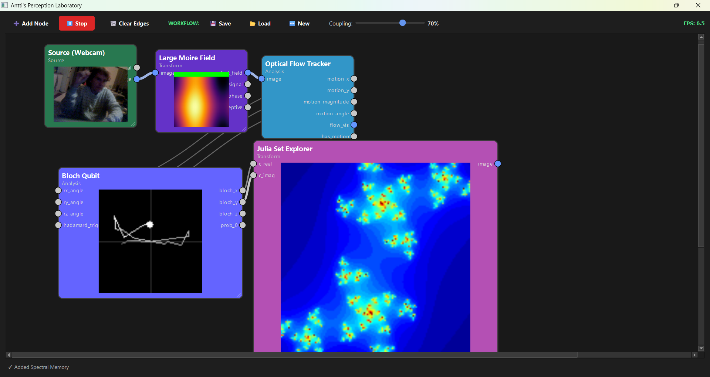

# Antti's Perception Laboratory (modular with node folder sepearate)

EDIT: I added a autodependency installer that installs dependencies by extracting imports from nodes 
folder. I have not tried it at all. Claude wrote it.. Could work, Could break your environment.. Who knows. 
No guarantees. 

Welcome to the Perception Laboratory, a professional, node-based interface for designing and running 
real-time multi-domain perception experiments. This modular system allows you to dynamically load, connect,
and interact with complex signal and image processing nodes.FeaturesModular Node System: Dynamically load
any Python-based node from the nodes/ folder.Real-Time Processing: Runs a main processing loop at ~30 FPS,
perfect for interactive experiments.Multi-Domain: Seamlessly mix and route audio signals, video/image data, 
and complex frequency spectrums.Resizable Nodes: Click and drag the bottom-right corner of any node to
resize it for better visibility.Save/Load Graphs: Save your complex node layouts and connections to a JSON
file and load them later.Configurable: Right-click nodes to configure their internal parameters
(e.g., sample rates, device IDs, physics constants).

# Installation

# Core Application Requirements

These are the essential libraries needed to run the main perception_lab_host.py application.

pip install PyQt6 numpy opencv-python pyqtgraph pyaudio Pillow

# All Nodes Requirements (Recommended)

To ensure all provided nodes load correctly, install their specific dependencies:

pip install scipy numba mne scikit-learn networkx PyWavelets 
(etc, check out the imports of the node you are running in nodes folder)

# Note on PyAudio:

PyAudio can be tricky. If pip install pyaudio fails:

Windows: pip install pyaudio (usually works)

macOS: brew install portaudio && pip install pyaudio

Linux: sudo apt-get install portaudio19-dev && pip install pyaudio

# Running the Application

Once all dependencies are installed, just run the host file:

python perception_lab_host.py

The application will start, scan the nodes/ folder, and print a list of all successfully loaded nodes 
to the console.

# How to Use

Add Node: Click the "Load Node Script" button and select a file from the nodes/ folder. If the file
contains multiple nodes (like math_nodes_advanced.py), you'll be asked which one to add.

# Connect Nodes: 

Click and drag from an output port (right side of a node) to a matching-color input port (left side).

Move Node: 

Click and drag the body of a node.

Resize Node: 

Click and drag the diagonal handle in the bottom-right corner of a node.

Configure/Delete: 

Right-click a node to open its configuration dialog or to delete it.

Start/Stop: Use the "Start" button to begin the real-time processing loop.

To create a new node:

Create a .py file inside your nodes/ folder (e.g., nodes/my_node.py).

At the top of your file, add all the imports your node needs (like import numpy as np, import cv2, etc.).

Add this 4-line "magic" block to connect to the main app:

Python

import __main__
BaseNode = __main__.BaseNode
QtGui = __main__.QtGui
PA_INSTANCE = getattr(__main__, "PA_INSTANCE", None)
Create your class inheriting from BaseNode:

Python

class MyNode(BaseNode):
    NODE_CATEGORY = "Transform"
    NODE_COLOR = QtGui.QColor(100, 200, 100)

    def __init__(self):
        super().__init__()
        self.node_title = "My Cool Node"
        self.inputs = {'signal_in': 'signal'}
        self.outputs = {'signal_out': 'signal'}
        self.my_data = 0.0

    def step(self):
        # 1. Get data
        in_val = self.get_blended_input('signal_in', 'sum') or 0.0
        # 2. Do logic
        self.my_data = in_val * 100

    def get_output(self, port_name):
        # 3. Send data
        if port_name == 'signal_out':
            return self.my_data
That's it. The main app (perception_lab_host.py) will automatically find and load it.

Your trusty AI will get this. 

# The nodes it comes with. 

Just some crazy stuff I have done.. 

I hope you like it. 

Licence MIT.
